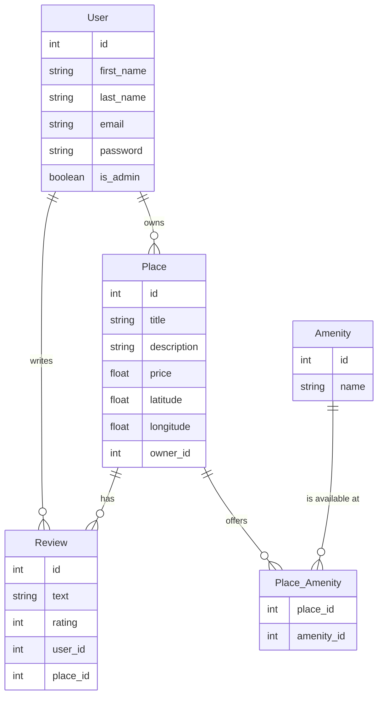

# Database Diagram for HBnB Project

This diagram visually represents the database schema structure for the HBnB project, highlighting the core entities and their relationships.

## 🎯 Core Entities and Attributes

### User
- `id`, `first_name`, `last_name`, `email`, `password`, `is_admin`

### Place
- `id`, `title`, `description`, `price`, `latitude`, `longitude`, `owner_id`

### Review
- `id`, `text`, `rating`, `user_id`, `place_id`

### Amenity
- `id`, `name`

### Place_Amenity (join table for many-to-many relationships between Place and Amenity)
- `place_id`, `amenity_id`

## 🔗 ER Diagram using Mermaid.js

## 🚦 Explanation of Relationships

- **User → Place** *(one-to-many)*  
  A user can own multiple places.

- **User → Review** *(one-to-many)*  
  A user can write multiple reviews.

- **Place → Review** *(one-to-many)*  
  A place can receive multiple reviews.

- **Place ↔ Amenity** *(many-to-many)*  
  A place can have multiple amenities, and an amenity can be found in multiple places, represented through the intermediate table **Place_Amenity**.
